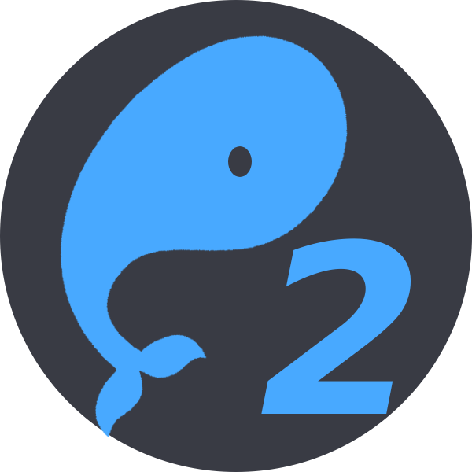

<div align="center">
    
    <br/>
    <br/>
    <a href="https://github.com/pwnpad/pwnpad/blob/master/LICENSE"></a>
    
    <h1>PwnPad Lima</h1>
    <p>A fully virtualised environment</p>
</div>

## Requirements

If you are building this yourself, you will need the following tools installed:

### MacOS

- `ansible` (not required if not building)
- `lima`
- `qemu` (not required if not building)

```bash
brew install ansible lima qemu
```

### Linux (Arch-based)

- `ansible` (not required if not building)
- `lima-bin`
- `qemu-full`

```bash
yay -S ansible lima-bin qemu-full
```

## Building

To build the VM yourself:

```bash
./build_vm.sh
```

If you would like to export the VM to a qcow2 file:

```bash
./create_qcow2.sh
```

## Usage

Create the new VM using the following command:

```bash
limactl create --yes https://raw.githubusercontent.com/pwnpad/pwnpad-lima/refs/heads/master/lima/pwnpad.yml
```
